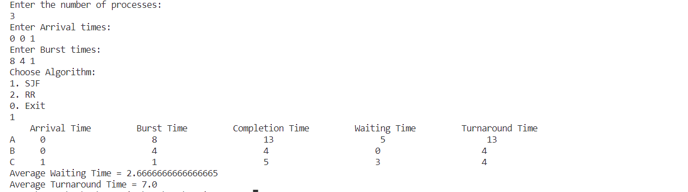

# CPU-Scheduling
The project containts the implementation of Round-Robin(RR) and The Shortest-Job-First(SJF) CPU scheduling algorithms in java

## RR
In the RR algorithm, each process is given a fixed time slice (also known as a time quantum), and the CPU scheduler rotates between the processes in a circular fashion. When a process is given its time slice, it runs for that specific amount of time before being preempted, and the next process in the queue is given the CPU.The implementation of the RR algorithm can be found in the <a href="https://github.com/Mahmoud175/CPU-Scheduling/blob/main/Src/RR.java">RR.java</a> file. The program reads in the processes and outputs the waiting time, completion time and turnaround time for each process.

## SJF

In SJF, the process with the shortest CPU burst time is given the highest priority, and the CPU scheduler selects it to run first. This ensures that the processes with the shortest execution time are completed first, which can lead to reduced average waiting times and turnaround times for all processes.The implementation of the SJF algorithm can be found in the <a href="https://github.com/Mahmoud175/CPU-Scheduling/blob/main/Src/SJF.java">RR.java</a> file. The program reads in the processes and outputs the waiting time, completion time and turnaround time for each process.

